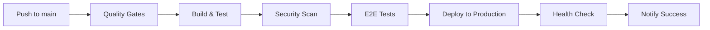

# 🚀 Production Deployment Guide

## Overview

This guide covers deploying Bot Architect Studio to production with
enterprise-grade standards, monitoring, and security.

## Prerequisites

### Required Accounts & Services

- ✅ GitHub repository with Actions enabled
- ✅ Supabase project for database
- ✅ Sentry account for error tracking
- ✅ Codecov account for coverage reporting
- ✅ Deployment platform (Vercel/Netlify/AWS)

### Required Secrets

Configure these in GitHub repository settings:

#### Core Application Secrets

```bash
VITE_SUPABASE_URL=https://your-project.supabase.co
VITE_SUPABASE_ANON_KEY=your-supabase-anon-key
VITE_SENTRY_DSN=https://your-sentry-dsn@sentry.io/project
```

#### Deployment Secrets

```bash
# For Vercel
VERCEL_TOKEN=your-vercel-token
VERCEL_ORG_ID=your-org-id
VERCEL_PROJECT_ID=your-project-id

# For Netlify
NETLIFY_AUTH_TOKEN=your-netlify-token
NETLIFY_SITE_ID=your-site-id

# For AWS
AWS_ACCESS_KEY_ID=your-access-key
AWS_SECRET_ACCESS_KEY=your-secret-key
```

#### Monitoring & Analytics

```bash
CODECOV_TOKEN=your-codecov-token
GOOGLE_ANALYTICS_ID=GA-XXXXXXXXX
```

## Deployment Platforms

### Option 1: Vercel (Recommended)

#### Setup Steps:

1. **Install Vercel CLI**

   ```bash
   npm i -g vercel
   ```

2. **Login and Link Project**

   ```bash
   vercel login
   vercel link
   ```

3. **Configure Environment Variables**

   ```bash
   vercel env add VITE_SUPABASE_URL
   vercel env add VITE_SUPABASE_ANON_KEY
   vercel env add VITE_SENTRY_DSN
   ```

4. **Deploy**
   ```bash
   vercel --prod
   ```

#### Automatic Deployment:

- Pushes to `main` branch trigger automatic deployment
- Preview deployments for all PRs
- Built-in performance monitoring

### Option 2: Netlify

#### Setup Steps:

1. **Install Netlify CLI**

   ```bash
   npm i -g netlify-cli
   ```

2. **Login and Initialize**

   ```bash
   netlify login
   netlify init
   ```

3. **Configure Build Settings**

   - Build command: `npm run build`
   - Publish directory: `dist`

4. **Deploy**
   ```bash
   netlify deploy --prod
   ```

### Option 3: AWS S3 + CloudFront

#### Setup Steps:

1. **Create S3 Bucket**

   ```bash
   aws s3 mb s3://bot-architect-studio-prod
   ```

2. **Configure Bucket for Static Hosting**

   ```bash
   aws s3 website s3://bot-architect-studio-prod \
     --index-document index.html \
     --error-document index.html
   ```

3. **Deploy**
   ```bash
   npm run build
   aws s3 sync dist/ s3://bot-architect-studio-prod
   ```

## Environment Configuration

### Production Environment Variables

```bash
# Application
VITE_APP_ENV=production
VITE_APP_VERSION=1.0.0
VITE_APP_NAME="Bot Architect Studio"

# Database
VITE_SUPABASE_URL=https://your-project.supabase.co
VITE_SUPABASE_ANON_KEY=your-production-anon-key

# Monitoring
VITE_SENTRY_DSN=https://your-sentry-dsn@sentry.io/project
VITE_ENABLE_PERFORMANCE_MONITORING=true
VITE_ENABLE_ERROR_TRACKING=true
VITE_ENABLE_LOGGING=false

# Security
VITE_ENABLE_CSP=true
VITE_ENABLE_HTTPS_ONLY=true

# Analytics
VITE_GOOGLE_ANALYTICS_ID=GA-XXXXXXXXX
```

## CI/CD Pipeline

### Automated Quality Gates

1. ✅ **Code Quality**: ESLint + TypeScript checks
2. ✅ **Testing**: Unit tests with 80% coverage requirement
3. ✅ **Security**: npm audit + dependency scanning
4. ✅ **Performance**: Bundle size monitoring
5. ✅ **E2E Testing**: Playwright cross-browser tests
6. ✅ **Build Verification**: Production build validation

### Deployment Flow



## Monitoring & Alerting

### Error Tracking (Sentry)

- Real-time error monitoring
- Performance tracking
- User session replay
- Custom alerts for critical errors

### Performance Monitoring

- Core Web Vitals tracking
- Bundle size monitoring
- API response time tracking
- User interaction analytics

### Health Checks

```bash
# Application health endpoint
curl https://your-domain.com/health

# Expected response:
{
  "status": "healthy",
  "timestamp": "2024-01-01T00:00:00Z",
  "version": "1.0.0",
  "environment": "production"
}
```

## Security Configuration

### Content Security Policy

```javascript
// Configured in deployment/vercel.json
"Content-Security-Policy": "default-src 'self'; script-src 'self' 'unsafe-inline'; style-src 'self' 'unsafe-inline';"
```

### Security Headers

- ✅ X-Frame-Options: DENY
- ✅ X-Content-Type-Options: nosniff
- ✅ X-XSS-Protection: 1; mode=block
- ✅ Referrer-Policy: strict-origin-when-cross-origin
- ✅ Permissions-Policy: camera=(), microphone=()

## Rollback Strategy

### Automatic Rollback Triggers

- Health check failures
- Error rate > 5%
- Performance degradation > 50%

### Manual Rollback

```bash
# Vercel
vercel rollback

# Netlify
netlify deploy --alias previous-deployment

# AWS
aws s3 sync s3://backup-bucket/ s3://production-bucket/
```

## Post-Deployment Checklist

### Immediate Verification (0-5 minutes)

- [ ] Application loads successfully
- [ ] Authentication works
- [ ] Core features functional
- [ ] No console errors
- [ ] Performance metrics normal

### Extended Verification (5-30 minutes)

- [ ] Error tracking active
- [ ] Analytics collecting data
- [ ] Database connections stable
- [ ] API endpoints responding
- [ ] User workflows complete

### Monitoring Setup (30+ minutes)

- [ ] Set up alerts for error rates
- [ ] Configure performance thresholds
- [ ] Verify backup systems
- [ ] Test rollback procedures
- [ ] Update documentation

## Troubleshooting

### Common Issues

#### Build Failures

```bash
# Check build logs
npm run build

# Common fixes
npm ci --force
rm -rf node_modules package-lock.json && npm install
```

#### Environment Variable Issues

```bash
# Verify variables are set
echo $VITE_SUPABASE_URL

# Check deployment platform settings
vercel env ls
netlify env:list
```

#### Performance Issues

```bash
# Analyze bundle
npm run build:analyze

# Check lighthouse scores
npx lighthouse https://your-domain.com
```

## Support & Maintenance

### Regular Maintenance Tasks

- Weekly dependency updates
- Monthly security audits
- Quarterly performance reviews
- Annual architecture reviews

### Emergency Contacts

- DevOps Team: devops@company.com
- Security Team: security@company.com
- On-call Engineer: +1-XXX-XXX-XXXX
